# Translations of AI Engineering

|  |  |
| -- | -- |
|  | **Japanese** **Title:** *AIエンジニアリング ―基盤モデルを用いたAIアプリケーション開発の基礎と実践* **Publisher:** O'Reilly Japan Inc. **Publication date:** November 26, 2025 **ISBN:** 9784814401383 **Links:** [O'Reilly Japan](https://www.oreilly.co.jp/books/9784814401383/) |
| 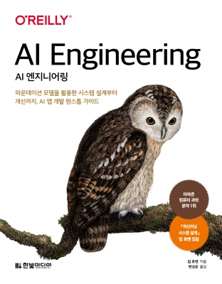 | **Korean** **Title:** *AI 엔지니어링: 파운데이션 모델을 활용한 시스템 설계부터 개선까지, AI 앱 개발 원스톱 가이드* **Publisher:** Hanbit **Publication date:** September 30, 2025 **ISBN:** 9791169214278 **Links:** [Hanbit](https://www.hanbit.co.kr/store/books/look.php?p_code=B3535685426), [YES24](https://www.yes24.com/product/goods/154925812) |
|  | **Chinese, Traditional** **Title:** *AI工程：從基礎模型建構應用* **Publisher:** GoTop Information Inc. **Publication date:** August 25, 2025 **ISBN:** 9786264251358 **Links:** [GoTop](https://www.gotop.com.tw/books/bookdetails.aspx?types=a&bn=A806), [Sanmin](https://www.sanmin.com.tw/product/index/014773424) |
|  | **Chinese, Simplified** **Title:** *AI工程：大模型应用开发实战* **Publisher:** Posts & Telecom Press **Publication date:** February 20, 2026 **ISBN:** 9787115686398 **Links:** [Dangdang](https://product.dangdang.com/30013700.html), [Sanmin](https://www.sanmin.com.tw/product/index/015236790) |
|  | **Vietnamese** **Title:** *Kỹ thuật AI: Xây dựng ứng dụng với mô hình nền tảng* **Publisher:** Times Science and Education Publishing **Publication date:** December 1, 2025 **ISBN:** 9786044522623 **Links:** [Times Corporation](https://shop.timescorporation.vn/sach-ky-thuat-ai-xay-dung-ung-dung-voi-mo-hinh-nen-tac-gia-chip-huyen) |
| 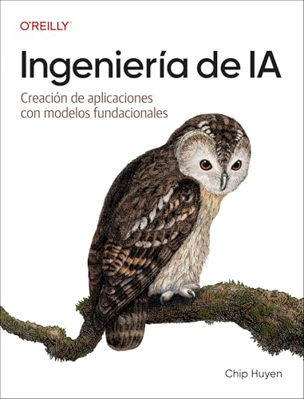 | **Spanish** **Title:** *Ingeniería de IA: Creación de aplicaciones con modelos fundacionales* **Publisher:** O'Reilly Media **Publication date:** May 15, 2026 **ISBN:** 9781098180201 **Links:** [Amazon.es](https://bit.ly/4piliIn), [Books-A-Million](https://www.booksamillion.com/p/Ingeniera-Ia-Spanish/Chip-Huyen/9781098180201), [Goodreads](https://www.goodreads.com/book/show/247692783-ingenier-a-de-ia-spanish-edition) |
| 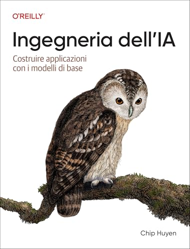 | **Italian** **Title:** *Ingegneria dell'IA: Costruire applicazioni con i modelli di base* **Publisher:** O'Reilly Media **Publication date:** March 18, 2026 **ISBN:** 9798341671317 **Links:** [Amazon.it](https://www.amazon.it/-/en/Ingegneria-Dellia-Italian-Applicazioni-Fondazione/dp/B0GM5V47D7/), [The Portobello Bookshop](https://www.theportobellobookshop.com/9798341671317), [Goodreads](https://www.goodreads.com/book/show/247800985-ingegneria-dell-ia-italian-edition) |
| 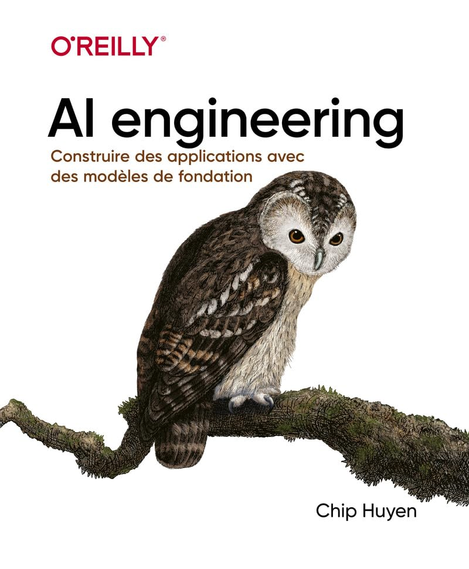 | **French** **Title:** *Ingénierie de l'IA: concevoir des applications avec des modèles de fondation* **Publisher:** Editions First **Publication date:** January 29, 2026 **ISBN:** 9782412104415 **Links:** [Lisez](https://www.lisez.com/livres/ingenierie-de-lia/9782412104415), [Eyrolles](https://www.eyrolles.com/Informatique/Livre/ingenierie-de-l-ia-9782412104415/), [Goodreads](https://www.goodreads.com/book/show/243690974-ing-nierie-de-l-ia---concevoir-des-applications-avec-des-mod-les-de-fond) |
| 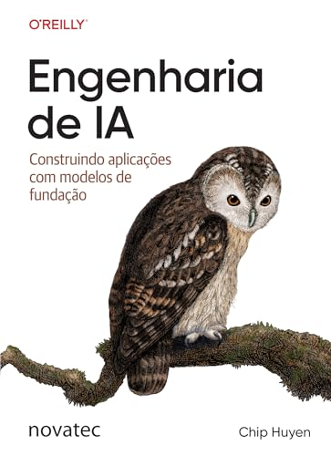 | **Portuguese** **Title:** *Engenharia de IA: Construindo aplicações com modelos de fundação* **Publisher:** Novatec **Publication date:** March 26, 2025 **ISBN:** 9788575229965 **Links:** [Novatec](https://novatec.com.br/livros/engenharia-de-ia/), [Goodreads](https://www.goodreads.com/book/show/252478526-engenharia-de-ia) |
| 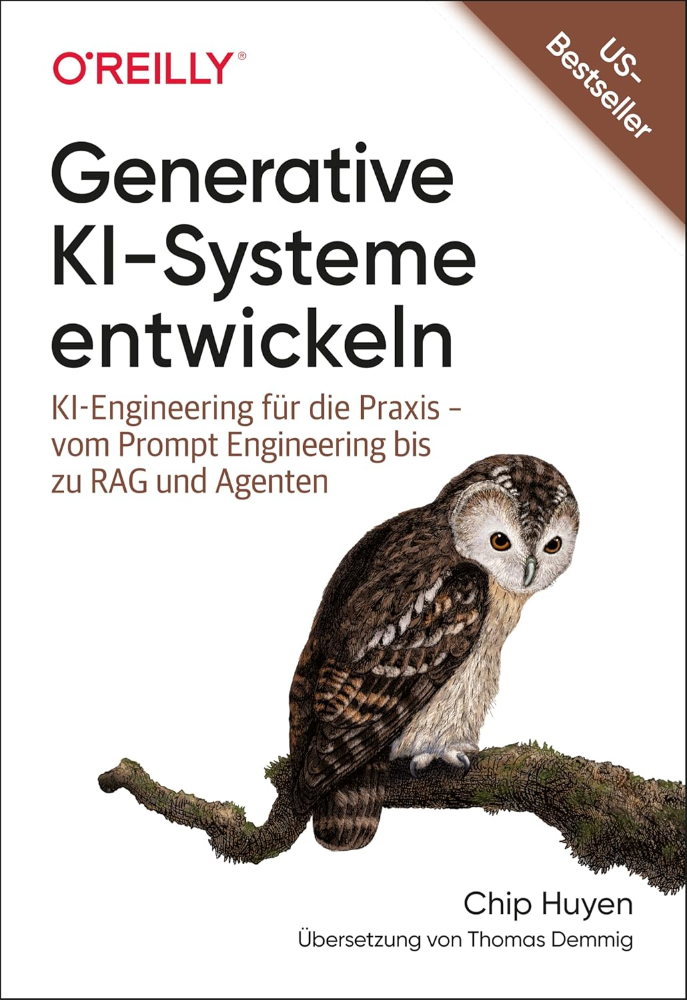 | **German** **Title:** *Generative KI-Systeme entwickeln: KI-Engineering für die Praxis – vom Prompt Engineering bis zu RAG und Agenten* **Publisher:** dpunkt **Publication date:** December 11, 2025 **ISBN:** 9783960092766 **Links:** [dpunkt](https://dpunkt.de/produkt/generative-ki-systeme-entwickeln/), [Goodreads](https://www.goodreads.com/book/show/243126778-generative-ki-systeme-entwickeln) |
| 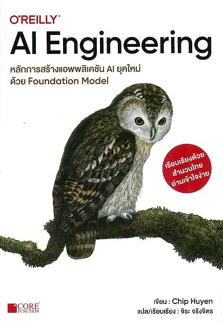 | **Thai** **Title:** *AI Engineering หลักการสร้างแอพลิเคชัน AI ยุคใหม่ด้วย Foundation Model* **Publisher:** Documation **Publication date:** January 15, 2026 **ISBN:** 9786168282496 **Links:** [Naiin](https://www.naiin.com/product/detail/694038), [A-Book Distribution](https://www.a-bookdistribution.com/product/1280103) |
| 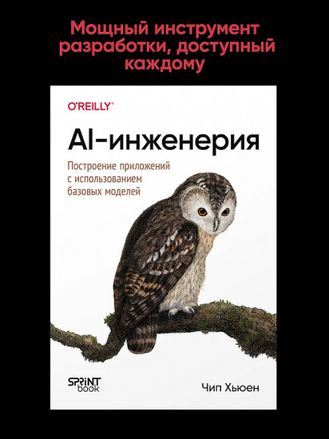 | **Russian** **Title:** *AI-инженерия. Построение приложений с использованием базовых моделей* **Publisher:** Sprint Book LLP **Publication date:** December 29, 2025 **ISBN:** 9786011245951 **Links:** [Flip.kz](https://www.flip.kz/catalog?prod=5764935), [Apple Books](https://books.apple.com/us/book/ai-%D0%B8%D0%BD%D0%B6%D0%B5%D0%BD%D0%B5%D1%80%D0%B8%D1%8F-%D0%BF%D0%BE%D1%81%D1%82%D1%80%D0%BE%D0%B5%D0%BD%D0%B8%D0%B5-%D0%BF%D1%80%D0%B8%D0%BB%D0%BE%D0%B6%D0%B5%D0%BD%D0%B8%D0%B9-%D1%81-%D0%B8%D1%81%D0%BF%D0%BE%D0%BB%D1%8C%D0%B7%D0%BE%D0%B2%D0%B0%D0%BD%D0%B8%D0%B5%D0%BC/id6758702124) |
| 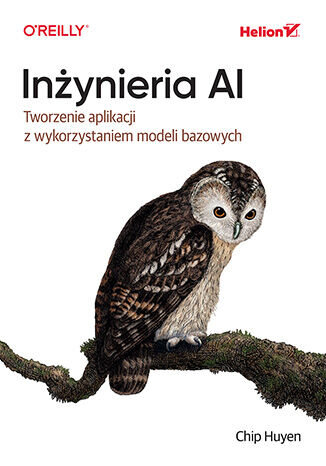 | **Polish** **Title:** *Inżynieria AI. Tworzenie aplikacji z wykorzystaniem modeli bazowych* **Publisher:** Helion **Publication date:** September 2, 2025 **ISBN:** 9788328926288 **Links:** [Helion](https://helion.pl/ksiazki/inzynieria-ai-tworzenie-aplikacji-z-wykorzystaniem-modeli-bazowych-chip-huyen,inaitw.htm#format/d) |
|  | **English Audiobook** **Title:** *AI Engineering: Building Applications with Foundation Models* **Publisher:** Recorded Books / Ascent Audio **Publication date:** June 17, 2025 **ISBN:** 9781663753045 **Links:** [RBmedia](https://rbmediaglobal.com/audiobook/9781663753045/), [Kobo](https://www.kobo.com/us/en/audiobook/ai-engineering-1), [Goodreads](https://www.goodreads.com/book/show/229819344-ai-engineering) |
| 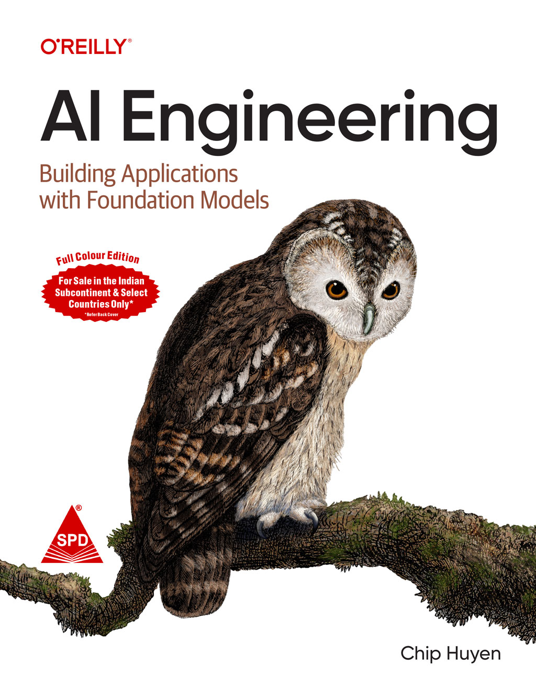 | **English Reprint, India** **Title:** *AI Engineering (Full Colour Edition): Building Applications with Foundation Models* **Publisher:** Shroff/O'Reilly **Publication date:** December 18, 2024 **ISBN:** 9789355426666 **Links:** [Shroff Publishers](https://www.shroffpublishers.com/books/9789355426666/), [SapnaOnline](https://www.sapnaonline.com/books/ai-engineering-building-applications-foundation-chip-huyen-9355426666-9789355426666) |
| 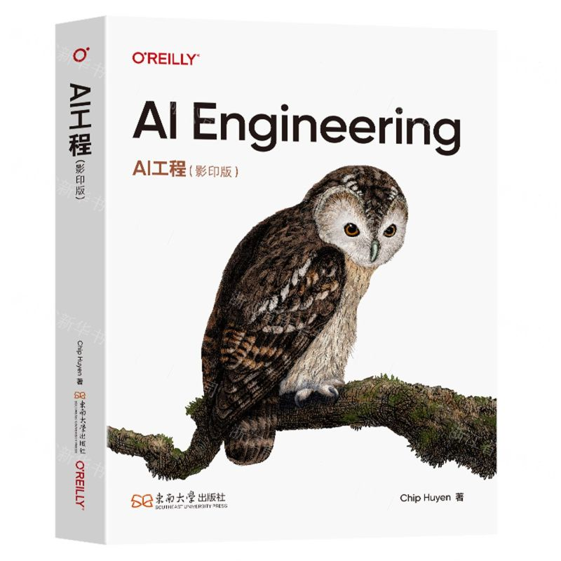 | **English Reprint, Mainland China** **Title:** *AI Engineering / AI工程（影印版）（英文版）* **Publisher:** Southeast University Press **Publication date:** April 15, 2025 **ISBN:** 9787576620047 **Links:** [Dangdang](https://product.dangdang.com/29867286.html), [Xinhua Bookstore](https://aus.zxhsd.com/kgsm/ts/2025/04/07/6550324.shtml), [Google Books](https://books.google.com/books/about/AI_Engineering.html?id=j9KC0QEACAAJ) |
| TBC | **Greek** **Publisher:** Papasotiriou **Publication date:** TBC **ISBN:** TBC **Links:** TBC |
| TBC | **Ukrainian** **Publisher:** ArtHuss **Publication date:** TBC **ISBN:** TBC **Links:** TBC |
| TBC | **Uzbek** **Publisher:** Risqiddin Rustamov **Publication date:** TBC **ISBN:** TBC **Links:** TBC |
